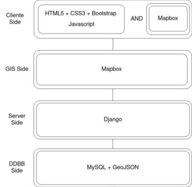
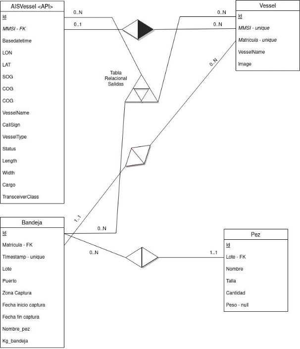
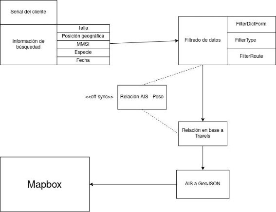
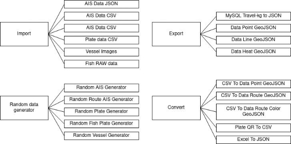
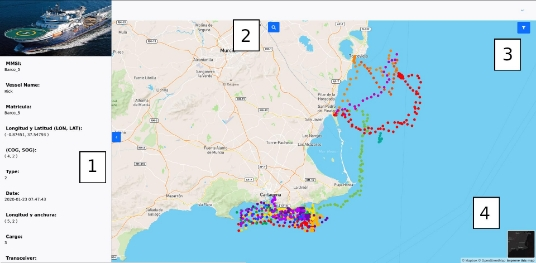
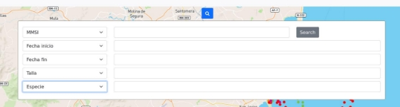
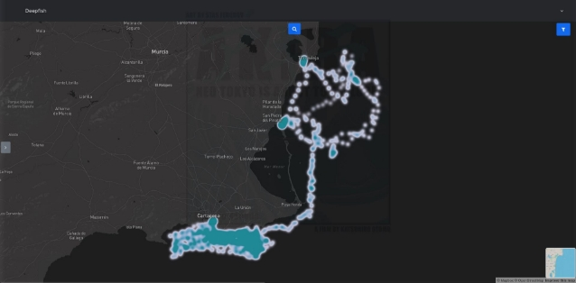
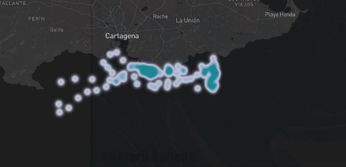



# FV4.2 Informe características WEB GIS

### Sebastian Pasker

#### Especialista Técnico de Deepfish2

##### Introducción.

En este documento se explica la webGIS creada enel marco del proyecto Deepfish2. Una webGIS es una página web de representación de información geográfica (Geographical Information System). Una webGIS permite que se pueda conectar cualquier cliente onlie, y la facilidad para mostrar información geográfica de manera visual de alguna variable, en este caso será de actividad pesquera de las lonjas..

La webGIS de este proyecto se centra en la representación de información AIS (Automatic Identification System) que permite a los buques compartir su posición geográfica, además de otra información de posible interés. En conjunto con nuestro sistema de Inteligencia Artificial de reconocimiento de especies y tallas de Deepfish, hemos pretendido crear un sistema que relacione la información geográfica de posición de los barcos con la de pesca marina, para representar qué zonas ha habido mayor intensidad de actividad pesquera.

Aclarar que el resultado final es una simulación del potencial de uso que se le puede dar en un futuro. Este proyecto se ha creado en colaboración con el Centro Tecnológico Naval que han adaptado y cedido datos AIS de Cabo de Palos, Murcia. Además de Javier Atalah, del Departamento de Ciencias del Mar y Biología Aplicada.

##### Investigación previa.

Para la creación de la webGIS, se ha investigado cuál sería el recurso más preciso y óptimo para detectar el posicionamiento geográfico de las embarcaciones pesqueras. Optando por tres tecnologías: VMS (Vessel Monitoring System), AIS (Automatic Identification System) y VBD (VIIRS Boat Detection).

VMS (Vessel Monitoring System), también llamado *Sistema de Monitoreo de Embarcaciones,* es un sistema de rastreo por posición geográfica (al igual que AIS) pero estos datos se han restringido históricamente al uso de reguladores gubernamentales u otras autoridades pesqueras.

VBS (VIIRS Boat Detection) es un sistema de recopilación de posición en base a la recolección satelital de la iluminación de embarcaciones.

Ambas tecnologías se han descartado, principalmente por la dificultad desde la entidad investigadora para conseguir los datos. Ofrecen diferentes ventajas en otro contexto como los siguientes:

- VMS presenta una mayor precisión que AIS.
- Más barcos presentan tecnologías VMS por legislación que AIS debido al requisito de tamaño mínimo para su instalación.
- VBS puede detectar el posicionamiento no rastreado de embarcaciones.

En cambio, AIS presenta las siguientes ventajas en comparación al resto.

- Fácil accesibilidad. A pesar que los precios de datasets históricos y la recopilación de información desde otras entidades como MarineTraffic o VesselFinder son bastante elevados, con fin de estudio hay datasets públicos y se puede crearun radar propio para larecopilación de información en cualquier espacio.
- Bajo coste. Se pueden montar sistemas AIS por costes realmente bajos, pudiendo montar un radar AIS con una raspberry Pi y una antena de menos de 10€.

##### Arquitectura

Para crear una webGIS, se ha necesitado un servidor web que resuelva las peticiones de los clientes, un servidor GIS que procese y resuelva las consultas geográficas, y un servidor que guarda la información en una base de datos.

1. **Capa Web**

El servidor web es un programa informático que procesa una aplicación del lado del servidor, realizando conexiones bidireccionales con el cliente. En este caso, para el servidor hemos elegido Django.

Django es un framework de desarrollo web, escrito en Python. Se ha elegido este framework debido a la familiarización de parte de los especialistas con el sistema, además de su escalabilidad de cara al futuro.

2. **Capa GIS**

Se ha estado observando una variedad de servidores GIS, incluyendo GeoDjango, GeoServer, Mapnik, MapServer, GeoServer entre otros. Lo que se ha observado en términos generales es una curva de aprendizaje moderada/alta, que dificulta el progreso natural del proyecto. Se ha seleccionado Mapbox.

Mapbox es un proveedor de mapas en línea. Ofrece APIs para construir tu servidor GIS, es una aplicación gratuita hasta un número alto de visitas de la página web. Se ha utilizado la librería de *Mapbox GL JS* para construir los mapas y representar la información geográfica de diferente manera.

3. **Capa DDBB**

El servidor de la base de datos se encargará de recopilar la información de los análisis de las bandejas y los información AIS, para poder representarla a posteriori en el servidor GIS. Se utiliza mySQL como sistema de gestión de base de datos para asegurar un formato sólido a la hora de integrar los datos, y de forma embebida se introducen los datos en GeoJSON a la webGIS. GeoJSON es un tipo de formato de texto concreto adaptado para el posicionamiento geográfico.

En el apartado 3.5 se comentará la estructura de la base de datos y su razonamiento.

##### Sistema

Se han juntado los tres servicios solicitados en conjunto en un sistema Linux. Este programa es fácilmente integrable en cualquier ordenador debido a su fácil implementación con python. Requiriendo simplemente la instalación de dependencias con pip y su ejecución en el entorno Django.

Para el front end hemos utilizado CSS3, HTML5 y Bootstrap 4. Hay que comentar también que Mapbox solventa parte del backend debido a que hace las funcionalidades de un servidor GIS individual, pero también cumple parte del frontend ya que permite editar diferentes características de personalización dentro de los mapas.

La estructura en conjunto queda de la siguiente manera:

*Imagen A: Arquitectura de capas de la webGIS*

##### Base de datos

Se ha seguido una estructura que relaciona los datos AIS, los resultados de las bandejas y los barcos de pesca. Tiene como intención recopilar los datos de la forma menos procesada posible, la tabla AISVessel sigue la misma estructura que una señal AIS y la tabla de bandeja refleja los datos como se registra la información en la lonja de Campello. Dentro de una bandeja hay varios resultados de la talla y peso del pez, esto se guarda en la tabla Pez.

*Imagen B: Diagrama de la base de datos MySQL*

##### Funcionamiento interno

El flujo que sigue el programa es que el cliente hace una consulta desde la página web. Se procede a hacer el filtrado de datos, en el que pasamos las variables a buscar en el programa, filtramos los datos AIS en base a las variables de búsqueda y en base al tipo de mapeado que buscamos (de líneas, de puntos o de calor). De forma asíncrona relacionamos los pesos con los AIS correspondientes. Relacionamos en base a Travels (Barco-AIS-Bandejas), y pasamos los datos a GeoJSON para meterlo de manera embebida de regreso a la página web.

*Imagen C: Diagrama de flujo del programa.*

##### Optimización

Para la optimización del sistema se han implementado dos optimizaciones basadas en el rendimiento. La primera es el guardado asíncrono en una tabla de los viajes (Travels), relacionando la bandeja donde se analizan los resultados, los datos AIS y la embarcación correspondiente. Esto nos reduce considerablemente el número de búsquedas en la base de datos.

La segunda es el procesado y la escritura de los datos AIS en base al peso de pesca correspondiente de forma asíncrona. Esto nos ha reducido varios minutos las búsquedas complejas cuando se manejan una gran cantidad de datos.

##### Scripts de automatización

En el desarrollo del proyecto se ha priorizado la automatización de manejo y generación de datos, es por ello que se han desarrollado una variedad de scripts con ese mismo fin.

Hay una variedad amplía de scripts de importación de datos en Django. Estos se encuentran mayoritariamente dentro de la carpeta de comandos personalizados. Para la optimización del sistema mencionado anteriormente y de la exportación de los datos de manera embebida en la página web, se han creado scripts de exportación de datos.

Además, hay scripts generadores aleatorios de datos para la visualización y testeo del sistema y convertidores de tipos de datos.

Se puede observar la variedad de scripts de automatización de datos a continuación:

*Imagen D: Recopilación de scripts del proyecto.*

##### Frontend de la webGIS

La webGIS está conformada por tres partes: el mapa de enrutamiento y el mapa de calor.

El mapa de enrutamiento es la parte que enseña la información puramente relacionada con la embarcación y el mapa de calor representa la cantidad de biomasa pescada por zonas.

Para la representación de datos en forma de demo hemos utilizado datos AIS de Cabo de Palos, Murcia de doce embarcaciones pesqueras y los resultados obtenidos en Deepfish en la lonja de Campello.

1. **Mapa de enrutamiento**

Se ha desarrollado un mapa geográfico de puntos, en el que se prioriza la identificación de embarcaciones. Esto da resultado a nuestro mapa de enrutamiento. Se separa cada barco en base a un color. Centrándonos más en la información que nos da el dato AIS.

*Imagen E: Puntos del mapa de enrutamiento.*

La opción 1 representa la información que nos dan los datos AIS. Esto incluye el MMSI, el nombre del barco, la matrícula, longitud y latitud de la posición del barco, velocidades, fecha, tipo de barco, etc. Además de una imagen relacionada al barco en caso de tenerlo. La opción 2 es un menú de búsquedas que comentaremos a continuación, el 3 un filtrado de datos y el 4 un botón para llegar al mapa de calor.

*Imagen F: Mapa de enrutamiento.*

El menú de búsquedas (opción 2) puede buscar en base al MMSI (Identificador del barco), especie del pez, rango de datos, posición geográfica y talla del pez. Tiene un menú desplegable donde se introduce la variable que buscamos y el dato relacionado.

*Imagen G: Sistema de búsquedas.*

2. **Mapa de calor**

Representa aquella información relacionada con la pesca de la biomasa por zonas. Representado con puntos de iluminación, crea un mapa de calor en base al valor y la frecuencia de puntos por zonas. Esto nos permite saber cuánto se ha pescado, pudiéndose clasificar por talla y especie. Permite realizar un registro histórico de la pesca.

*Imagen H: Mapa de calor.*

Aquí podemos ver una representación de cómo queda el mapa de calor, a continuación vamos a enseñar un ejemplo de búsqueda en base al MMSI del Barco 7.

*Imagen I: Búsqueda en base al MMSI.*

##### Resultados

Como resultado obtenemos un sistema webGIS diseñado con Django y Mapbox, que tiene una variedad de funcionalidades. En el que se incluye dentro del mapa de enrutamiento: un sistema de identificación de embarcaciones, un sistema de búsqueda, un filtrador de capas y un menú de despliegue de información. Dentro del mapa de calor se incluye un sistema de reconocimiento de pesca marítima por zonas.

Desde Deepfish2 creemos que aunque aún se limite a una demo, tiene un gran potencial si se aplica en un futuro como herramienta.
12
